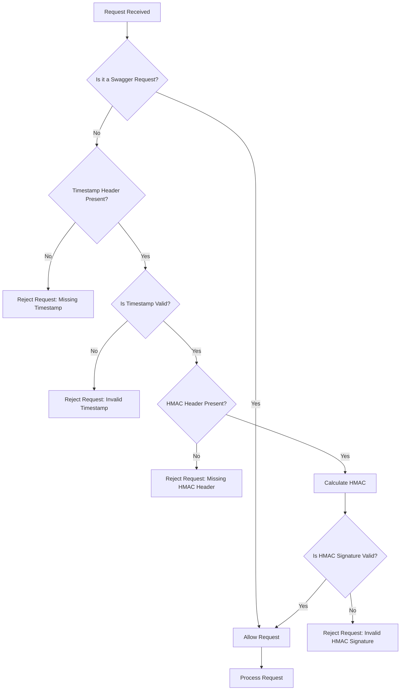

# HMAC Demo API

Project này minh họa cách triển khai xác thực HMAC (Hash-based Message Authentication Code) để bảo mật các đầu cuối API.

## Cách sử dụng

1. Khởi chạy `HmacDemoApplication`
2. Khởi chạy `HmacApiClient`
3. Console của `HmacApiClient` sẽ thực thi mã hóa HMAC, in ra lệnh `curl` tương ứng và trả về kết quả của request.

## Tính năng

- API REST Spring Boot đơn giản với demo đầu cuối
- Filter xác thực HMAC bảo mật tất cả các yêu cầu API
- Tài liệu Swagger/OpenAPI
- Client mẫu để thực hiện các yêu cầu đã xác thực

## Xác thực HMAC

Tất cả các yêu cầu API phải bao gồm chữ ký HMAC trong header `X-HMAC-SIGNATURE` và dấu thời gian trong header `X-TIMESTAMP`. Chữ ký được tính toán bằng thuật toán HmacSHA256 với dữ liệu sau:

```
<HTTP_METHOD>\n
<REQUEST_URI>\n
<QUERY_STRING>\n
<REQUEST_BODY>\n (nếu có)
<TIMESTAMP>
```

Ví dụ, đối với yêu cầu GET đến `/api/demo/sum?a=5&b=3` với dấu thời gian `1634567890123`, dữ liệu cần ký sẽ là:

```
GET
/api/demo/sum
a=5&b=3

1634567890123
```

Đối với yêu cầu POST với JSON body đến `/api/demo/sum` với dấu thời gian `1634567890123` và body `{"a":5,"b":3}`, dữ liệu cần ký sẽ là:

```
POST
/api/demo/sum

{"a":5,"b":3}
1634567890123
```

Phía API và client sẽ dùng cùng một khóa bí mật để tạo và xác thực chữ ký HMAC xem hai bên có khớp với nhau hay không. Nếu chữ ký không giống nhau, yêu cầu sẽ bị từ chối với mã trạng thái 401 Unauthorized.

## Cấu hình

Khóa bí mật HMAC được cấu hình trong `application.properties`:

```properties
hmac.secret=YourSecretKeyHere123!
```

## Xác thực dấu thời gian

Để ngăn chặn các cuộc tấn công phát lại, tất cả các yêu cầu phải bao gồm dấu thời gian hiện tại trong header `X-TIMESTAMP`. Dấu thời gian phải là số mili giây kể từ Epoch (1/1/1970) và phải nằm trong khoảng thời gian hợp lệ:

- Không cũ hơn quá 5 phút
- Không quá 1 phút trong tương lai (để cho phép sai lệch đồng hồ nhỏ)

Yêu cầu với dấu thời gian không hợp lệ sẽ bị từ chối với mã trạng thái 401 Unauthorized.

## Sơ đồ Filter



## Ví dụ sử dụng

### Sử dụng HmacApiClient

```java
// Tạo client với URL cơ sở và khóa bí mật
HmacApiClient client = new HmacApiClient("http://localhost:8080", "YourSecretKeyHere123!");

// Thực hiện yêu cầu đã xác thực
int result = client.sum(5, 3);
System.out.println("Kết quả tổng: " + result);
```

### Tạo HMAC thủ công

#### Cho yêu cầu GET

```java
// Tạo dấu thời gian hiện tại
String timestamp = String.valueOf(System.currentTimeMillis());

// Tạo chữ ký HMAC với dấu thời gian (không có request body)
String hmacSignature = HmacUtils.generateHmacSignature(
    "GET", 
    "/api/demo/sum", 
    "a=5&b=3", 
    timestamp,
    null, // Không có request body
    "YourSecretKeyHere123!"
);

// Thêm chữ ký và dấu thời gian vào header của yêu cầu HTTP
HttpRequest request = HttpRequest.newBuilder()
    .uri(URI.create("http://localhost:8080/api/demo/sum?a=5&b=3"))
    .header("X-HMAC-SIGNATURE", hmacSignature)
    .header("X-TIMESTAMP", timestamp)
    .GET()
    .build();
```

#### Cho yêu cầu POST với JSON body

```java
// Tạo dấu thời gian hiện tại
String timestamp = String.valueOf(System.currentTimeMillis());

// Tạo request body
SumRequest sumRequest = new SumRequest(5, 3);
ObjectMapper objectMapper = new ObjectMapper();
String requestBody = objectMapper.writeValueAsString(sumRequest);

// Tạo chữ ký HMAC với dấu thời gian và request body
String hmacSignature = HmacUtils.generateHmacSignature(
    "POST", 
    "/api/demo/sum", 
    "", // Không có query string
    timestamp,
    requestBody, // Bao gồm request body trong chữ ký
    "YourSecretKeyHere123!"
);

// Thêm chữ ký và dấu thời gian vào header của yêu cầu HTTP
HttpRequest request = HttpRequest.newBuilder()
    .uri(URI.create("http://localhost:8080/api/demo/sum"))
    .header("X-HMAC-SIGNATURE", hmacSignature)
    .header("X-TIMESTAMP", timestamp)
    .header("Content-Type", "application/json")
    .POST(HttpRequest.BodyPublishers.ofString(requestBody))
    .build();
```

## Tài liệu API

Tài liệu API có sẵn tại:
- Swagger UI: http://localhost:8080/swagger-ui.html
- OpenAPI JSON: http://localhost:8080/api-docs
