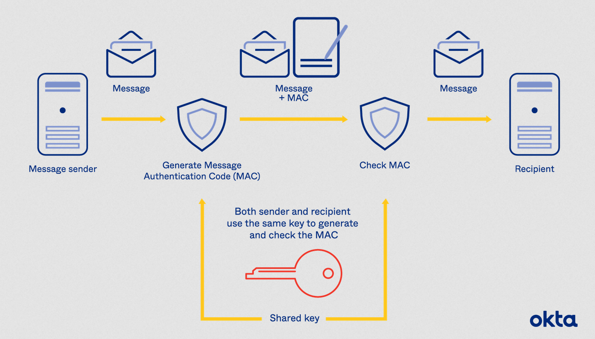
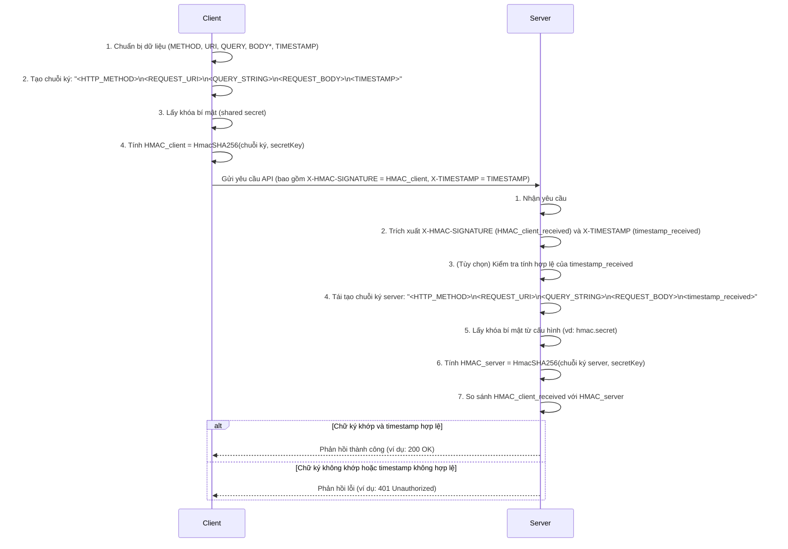

# Giải thích Cơ chế Hoạt động của Xác thực HMAC

HMAC (Hash-based Message Authentication Code) là một cơ chế xác thực tin nhắn sử dụng hàm băm mật mã kết hợp với một khóa bí mật. Nó đảm bảo cả **tính toàn vẹn dữ liệu** (dữ liệu không bị thay đổi) và **tính xác thực nguồn gốc** (dữ liệu thực sự đến từ người gửi dự kiến).



## HmacSHA256

Giả sử một người muốn gửi một lá thư quan trọng (là **dữ liệu**) cho một người khác và muốn đảm bảo hai điều:

1.  **Thư không bị ai sửa đổi trên đường đi** (tính toàn vẹn).
2.  **Người nhận biết chắc chắn thư đó là do chính người gửi, không phải ai giả mạo** (tính xác thực).

**HmacSHA256** giúp thực hiện điều này, giống như một con dấu niêm phong đặc biệt và một mã bí mật chỉ người gửi và người nhận biết.

Cách hoạt động cơ bản:

1.  **SHA256 (Công cụ tạo "dấu vân tay" cho dữ liệu):**
    * Đầu tiên, hãy nghĩ về SHA256 như một cỗ máy siêu đặc biệt. Khi bất kỳ nội dung nào được đưa vào cỗ máy này (ví dụ: toàn bộ nội dung lá thư), nó sẽ tạo ra một "dấu vân tay" duy nhất cho nội dung đó. Dấu vân tay này là một chuỗi ký tự và số có độ dài cố định (cụ thể là 256 bit, hay 64 ký tự thập lục phân).
    * Điều quan trọng:
        * Nếu nội dung thay đổi dù chỉ một chút, dấu vân tay (SHA256) sẽ hoàn toàn khác.
        * Không thể từ dấu vân tay đoán ngược lại được nội dung gốc.

2.  **HMAC (Cách sử dụng "dấu vân tay" với mã bí mật):**
    * HMAC là quy trình sử dụng "công cụ tạo dấu vân tay" SHA256 ở trên, nhưng thêm vào một yếu tố nữa: một **khóa bí mật** (secret key) mà chỉ các bên giao tiếp (ví dụ: người gửi và người nhận) biết.
    * **HMAC-SHA256 hoạt động như sau:**
        * Lấy nội dung dữ liệu (ví dụ: nội dung thư).
        * Kết hợp nội dung này với khóa bí mật theo một cách đặc biệt (quy trình HMAC định nghĩa cách kết hợp này, thường là băm hai lần).
        * Sau đó, cho hỗn hợp này qua "công cụ tạo dấu vân tay" SHA256.
        * Kết quả cuối cùng là một "chữ ký HMAC" (hay còn gọi là "tag" hoặc "mã xác thực").

3.  **Gửi đi và Kiểm tra:**
    * Người gửi gửi dữ liệu (lá thư) cùng với "chữ ký HMAC" này cho người nhận.
    * Khi người nhận nhận được dữ liệu:
        * Họ cũng có khóa bí mật (giống hệt khóa của người gửi).
        * Họ tự mình thực hiện lại quy trình HMAC-SHA256 trên nội dung dữ liệu mà họ nhận được, sử dụng khóa bí mật của họ.
        * Họ so sánh "chữ ký HMAC" mà họ vừa tạo ra với "chữ ký HMAC" được gửi kèm.

4.  **Kết quả:**
    * **Nếu hai chữ ký HMAC khớp nhau:** Người nhận biết rằng dữ liệu không bị ai sửa đổi trên đường đi (vì nếu sửa, chữ ký sẽ khác) VÀ dữ liệu đó đúng là do người gửi ban đầu (vì chỉ các bên liên quan mới biết khóa bí mật để tạo ra chữ ký đó).
    * **Nếu hai chữ ký HMAC không khớp:** Có nghĩa là dữ liệu đã bị thay đổi hoặc không phải từ nguồn gốc dự kiến.

**Tóm lại:**

**HmacSHA256** là một cách để tạo ra một "chữ ký số" cho dữ liệu. Chữ ký này được tạo bằng cách sử dụng thuật toán băm **SHA256** và một **khóa bí mật**. Nó giúp đảm bảo rằng dữ liệu vừa **nguyên vẹn** (không bị sửa đổi) vừa **xác thực** (đến từ đúng nguồn). Nó mạnh hơn việc chỉ dùng SHA256 đơn thuần vì có thêm yếu tố khóa bí mật, khiến kẻ gian không thể tự tạo ra chữ ký hợp lệ ngay cả khi họ biết nội dung dữ liệu.


## Tóm tắt Luồng Hoạt động Client-Server

Luồng hoạt động xác thực HMAC giữa client và server diễn ra như sau:

###  Phía Client:

1.  **Chuẩn bị dữ liệu:** Client tập hợp các thành phần của yêu cầu sẽ được sử dụng để tạo chữ ký. Dựa trên thông tin cung cấp, các thành phần này bao gồm:
    * Phương thức HTTP (ví dụ: GET, POST)
    * URI của yêu cầu (ví dụ: `/api/users`)
    * Chuỗi truy vấn (ví dụ: `?id=123&type=active`)
    * Body của yêu cầu (nếu có, ví dụ: dữ liệu JSON trong yêu cầu POST)
    * Một dấu thời gian (timestamp) hiện tại.
2.  **Tạo chuỗi để ký (string-to-sign):** Client nối các thành phần trên theo một định dạng cụ thể, cách nhau bởi ký tự xuống dòng (`\n`):
    ```
    <HTTP_METHOD>\n
    <REQUEST_URI>\n
    <QUERY_STRING>\n
    <REQUEST_BODY>\n
    <TIMESTAMP>
    ```
    *Lưu ý: `<REQUEST_BODY>` chỉ được thêm vào nếu yêu cầu có body.*
3.  **Tạo chữ ký HMAC:** Client sử dụng thuật toán HmacSHA256, **khóa bí mật** (đã được chia sẻ trước đó với server) và **chuỗi để ký** ở bước 2 để tạo ra một chữ ký HMAC.
4.  **Gửi yêu cầu:** Client gửi yêu cầu đến server, đính kèm:
    * Chữ ký HMAC vừa tạo vào header `X-HMAC-SIGNATURE`.
    * Dấu thời gian đã sử dụng ở bước 1 vào header `X-TIMESTAMP`.
    * Các phần còn lại của yêu cầu (method, URI, query string, body).

### Phía Server:

1.  **Nhận yêu cầu:** Server nhận yêu cầu từ client.
2.  **Trích xuất thông tin:** Server trích xuất chữ ký từ header `X-HMAC-SIGNATURE` và dấu thời gian từ header `X-TIMESTAMP`. Server cũng lấy các thành phần khác của yêu cầu (method, URI, query string, body).
3.  **Kiểm tra dấu thời gian (tùy chọn nhưng khuyến nghị):** Server có thể kiểm tra xem dấu thời gian `X-TIMESTAMP` có nằm trong một khoảng thời gian chấp nhận được hay không (ví dụ: trong vòng 5 phút so với thời gian hiện tại của server). Điều này giúp ngăn chặn các cuộc tấn công phát lại (replay attacks), nơi kẻ tấn công chặn một yêu cầu hợp lệ và gửi lại sau đó.
4.  **Tái tạo chuỗi để ký:** Server sử dụng các thành phần của yêu cầu (method, URI, query string, body) và **dấu thời gian `X-TIMESTAMP` nhận được từ client** để tạo lại **chuỗi để ký** theo đúng định dạng mà client đã sử dụng.
    ```
    <HTTP_METHOD>\n
    <REQUEST_URI>\n
    <QUERY_STRING>\n
    <REQUEST_BODY>\n
    <TIMESTAMP_FROM_HEADER>
    ```
5.  **Tạo chữ ký HMAC phía server:** Server sử dụng cùng thuật toán HmacSHA256, **khóa bí mật** của mình (được cấu hình trong `application.properties`, ví dụ: `hmac.secret=YourSecretKeyHere123!`) và **chuỗi để ký** vừa tái tạo ở bước 4 để tự tính toán một chữ ký HMAC.
6.  **So sánh chữ ký:** Server so sánh chữ ký mà nó vừa tạo ra với chữ ký nhận được từ client (trong header `X-HMAC-SIGNATURE`).
7.  **Quyết định xác thực:**
    * Nếu hai chữ ký **khớp nhau** (và dấu thời gian hợp lệ, nếu có kiểm tra), yêu cầu được coi là **xác thực**. Server tiếp tục xử lý yêu cầu.
    * Nếu hai chữ ký **không khớp**, yêu cầu bị coi là **không hợp lệ** (có thể đã bị giả mạo hoặc dữ liệu bị thay đổi). Server sẽ từ chối yêu cầu, thường trả về lỗi 401 Unauthorized hoặc 403 Forbidden.

## Sơ đồ Luồng (Mermaid Sequence Diagram)



## Cấu hình Khóa Bí mật

Như đã đề cập, khóa bí mật HMAC cần được chia sẻ và giữ bí mật giữa client và server. Phía server, khóa này thường được cấu hình trong một file properties, ví dụ:

```properties
hmac.secret=YourSecretKeyHere123!
```

**Quan trọng:**
* **Khóa bí mật phải được giữ tuyệt đối bí mật.** Nếu khóa bí mật bị lộ, kẻ tấn công có thể tạo ra các chữ ký hợp lệ và giả mạo yêu cầu.
* **Sử dụng thuật toán băm mạnh** như SHA256 (trong HmacSHA256) là rất quan trọng.
* **Việc đồng bộ thời gian** giữa client và server (hoặc cho phép một khoảng chênh lệch thời gian nhỏ) là cần thiết nếu có kiểm tra timestamp để chống replay attacks.

Cơ chế HMAC cung cấp một phương pháp mạnh mẽ để đảm bảo tính toàn vẹn và xác thực của các thông điệp được trao đổi, đặc biệt hữu ích trong các API.
